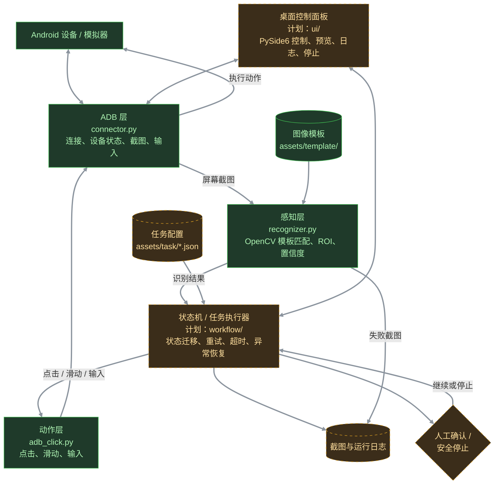

# Auto-Chaldea

基于 OpenCV、ADB 和 PySide6 的 Fate/Grand Order（Fate/GO）桌面辅助工具，用于减少重复、机械的操作。项目的核心思路是：通过截图识别当前画面，再由任务状态机决定下一步动作，最后使用 ADB 执行点击或滑动。

> **定位与边界**：本项目仅面向个人设备上的辅助研究与重复操作自动化。请遵守游戏服务条款、当地法律及设备安全要求，不用于绕过安全机制、网络对抗或影响其他玩家的行为。涉及账号风险的操作应默认人工确认。

## 当前状态

项目处于早期开发阶段，已经搭好以下基础能力：

- 通过本地 ADB 连接 Android 设备或模拟器
- 通过 ADB 截取当前屏幕
- 使用 OpenCV 模板匹配查找单个或多个 UI 元素
- 使用 ADB 执行坐标点击
- 使用 `assets/task`、`assets/template` 分离任务配置和图像模板
- 依赖 PySide6，为后续桌面控制面板预留基础

目前还没有完整的 Fate/GO 任务流程。README 中标记为“计划”的内容不代表已经实现。

## 目标

### 第一阶段：可观测、可停止

- 提供设备连接、截图预览和 ADB 状态检查
- 记录每次识别结果、点击动作、置信度和错误原因
- 支持全局暂停、停止和超时退出
- 所有高风险或不可逆操作都提供人工确认选项

### 第二阶段：稳定识别

- 建立按分辨率、界面和语言组织的模板库
- 支持 ROI（感兴趣区域）、多尺度匹配和颜色/轮廓等辅助识别
- 为模板设置置信度阈值、有效区域和失败处理策略
- 识别失败时保存截图，便于复盘和补充模板

### 第三阶段：任务编排

- 用状态机描述“当前画面 -> 条件判断 -> 动作 -> 下一状态”
- 支持启动任务、战斗循环、结果确认、返回和异常恢复等通用步骤
- 任务参数从 JSON 加载，避免把流程硬编码到识别器中
- 支持单步执行、模拟运行和断点恢复

### 第四阶段：桌面工具

- 使用 PySide6 提供设备选择、任务选择、日志和实时截图面板
- 展示当前状态、最近一次识别结果和操作倒计时
- 提供模板测试工具：选择截图区域、测试阈值、预览匹配结果
- 提供安全的停止入口，关闭窗口时主动结束正在运行的任务

## 设计



实线节点表示当前已有基础能力，虚线节点表示后续规划能力。

建议保持以下职责边界：

- `core/connector.py`：只负责设备连接和设备状态，不负责任务逻辑
- `core/recognizer.py`：只负责截图和识别结果，不直接执行点击
- `core/adb_click.py`：集中封装点击、滑动等输入动作
- `core/paths.py`：集中管理资源目录和可执行文件路径
- `task/`：保存任务配置和状态定义
- `template/`：保存经过命名和版本管理的模板图片
- 后续新增 `workflow/`：实现状态机、重试和异常恢复
- 后续新增 `ui/`：实现 PySide6 控制界面

## 目录规划

```text
src/auto_chaldea/
  core/
    connector.py       # ADB 连接
    adb_click.py       # 点击和输入动作
    recognizer.py      # 截图与 OpenCV 识别
    paths.py           # 路径管理
		task_repository.py  # 任务配置读取与步骤筛选
		task_executor.py    # 任务步骤执行
  workflow/             # 计划：状态机和任务执行器
	ui/                   # PySide6 界面
		task_table.py       # 任务步骤表格
assets/
  platform-tools/      # ADB 运行时文件
  template/            # UI 模板图片
  task/                # JSON 任务配置
dev_tools/              # 开发和调试脚本
tests/                  # 计划：单元测试和识别回归样本
```

## 开发路线

### M0：基础设施

- [x] 建立 uv 项目和 Python 入口
- [x] 接入 OpenCV、NumPy 和 PySide6 依赖
- [x] 封装 ADB 连接、截图、模板匹配和点击
- [ ] 增加统一日志和异常类型
- [ ] 增加设备探测、连接状态和超时检查

### M1：识别实验台

- [ ] 保存原始截图和识别调试图
- [ ] 支持 ROI、阈值和模板尺寸校验
- [ ] 统计模板匹配的误报、漏报和耗时
- [ ] 为常见分辨率建立最小回归样本

### M2：任务执行器

- [ ] 定义状态、条件、动作、超时和重试模型
- [ ] 支持点击、滑动、等待、截图和人工确认动作
- [ ] 实现安全停止、失败回退和最大重试次数
- [ ] 用虚拟截图测试任务状态迁移

### M3：首个可用流程

- [ ] 从主界面进入目标任务
- [ ] 处理战斗中的固定操作
- [ ] 识别结算画面并安全返回
- [ ] 任务结束后输出摘要和失败截图

### M4：桌面界面与维护

- [ ] 设备和任务选择
- [ ] 实时日志、截图和状态展示
- [ ] 模板调试与阈值配置
- [ ] 配置版本化、回归测试和发布说明

## 运行与开发

项目使用 Python `>=3.13` 和 uv：

```powershell
uv sync
uv run auto-chaldea
```

运行前请确认：

1. Android 设备或模拟器已开启 USB 调试，并允许当前电脑进行调试。
2. `assets/platform-tools/adb.exe` 存在，且设备可以被 ADB 识别。
3. 模板图片来自与目标设备一致的分辨率、缩放比例和语言设置。
4. 首次运行使用低风险、可人工观察的流程，并保留停止任务的方式。

## 任务配置约定

任务 JSON 建议包含唯一名称、初始状态、状态列表和全局限制。每个状态至少描述：

- `detect`：需要识别的模板、区域和最低置信度
- `actions`：要执行的动作及动作间隔
- `next`：成功后的下一状态
- `timeout`：等待当前状态的最长时间
- `retry`：识别或动作失败时的最大重试次数
- `fallback`：无法恢复时的停止、截图或人工确认策略

不要只依赖固定坐标判断页面状态。固定坐标可以作为动作输出，但页面流转应尽量由识别结果确认。

## 安全与可靠性原则

- 默认先截图确认，再执行动作；识别置信度不足时停止或请求人工确认。
- 每个动作都应有超时、日志和可中断路径。
- 不保存账号密码、令牌或与任务无关的个人数据。
- 不通过高频操作规避限制，不修改游戏客户端，不注入进程。
- 任务失败时优先停止并保存现场，而不是无限重试。
- 用离线截图和模拟设备测试识别逻辑，减少对真实账号的影响。

## 贡献与问题记录

提交新的任务或模板时，请同时说明：设备分辨率、系统缩放、游戏语言、模板来源、匹配阈值和已知限制。识别问题应附上脱敏后的截图、日志和复现步骤，避免只报告“点错了”。
